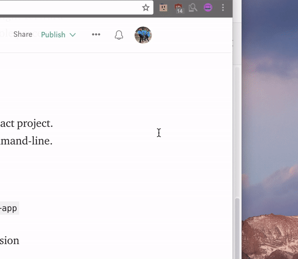
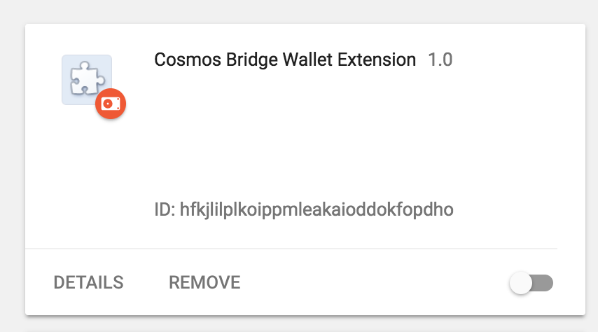

# Cosmic Bridge Wallet
Wallet plugin for Chrome.

### Concept

Allows users the ability to participate in a Cosmic Bridge payment network and send batched bitcoin payments (through the Cosmic Bridge application) directly from Chrome.

### Dev Notes

#### Setting up the extension locally
<ol>
<li>Run the following command from the `/cosmos-bridge-extension` directory:
<pre>
yarn build
</pre>
</li>
<li>
Navigate to the extensions page of your chrome browser.
</li>

<li>
Once there enabled "Developer mode".

</li>
<li>Drag the output of the build folder from step one into the chrome extensions browser page.</li>

</ol>

The extension should now be added to chrome in Developer mode.

