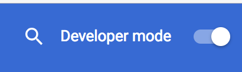

# Cosmic Bridge Wallet
Wallet plugin for Chrome.

### Status (May 2018)
For the time being, the Cosmic Bridge team chose to focus on the core - [the backend side of the solution](https://github.com/CosmicBridge/server/). We believe the best approach forward for the wallet would be to use [Lotion-connect](https://www.npmjs.com/package/lotion-connect) to create an in-browser light client that can function as a wallet in any Cosmic Bridge payment zone. If you'd like to work on this, please let us know or just hit us up with a good PR.

### Concept

Allows users the ability to participate in a Cosmic Bridge payment network and send batched bitcoin payments (through the Cosmic Bridge application) directly from Chrome.

### Dev Notes

#### Setting up the extension locally
<ol>
<li>
    Run the following command from the `/cosmos-bridge-extension` directory:
</li>
<pre>
    yarn build
</pre>
<li>
    Navigate to the extensions page of your chrome browser.
</li>

 
<li>
    Once there enable "Developer mode". 
</li>

 
<li>
    Drag the output of the build folder from step one into the chrome extensions browser page.
</li>

 
</ol>

The extension should now be added to chrome in Developer mode.

